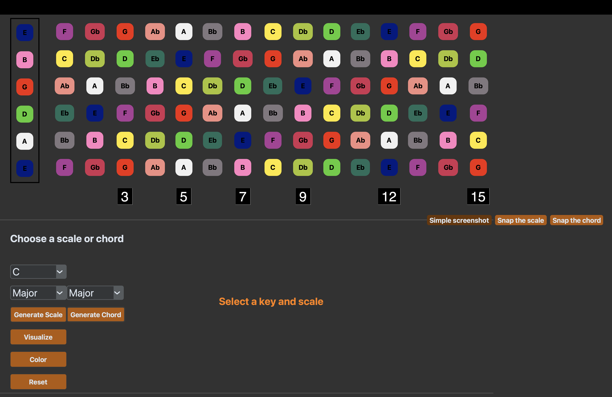

# tkinter_music
Harmonica and Guitar GUIs on TkInter


# How to run


## On MacOS

You must have Python installed on your system: https://www.python.org/downloads/

- Inside tkinter_music-main, create a virtual environment, activate it and install the requirements

```python
python3 -m venv .venv 
source .venv/bin/activate
pip install -r requirements.txt
```

- To see the harmonica or guitar gui, run the following commands. 

```python
python3 -m package.gui.harmonica_gui
python3 -m package.gui.guitar_gui
```


#### Guitar GUI Showcase
Main screen

C Major Scale

D Major Chord

Guitar to Piano

Color the fretboard


### Harmonica GUI Showcase

Main Screen

1st Position Major Pentatonic

2nd Position Minor Blues

3rd Position Dorian


# Future implementations

1. Implementing color pickers that let the user choose the colors for each individual note.
2. Consider how tkinter looks on Linux and Windows.
3. Use more CTk as opposed to TK for scaling issues.
4. Comment more as I go. 


# Love

I love harmonica, guitar & piano!